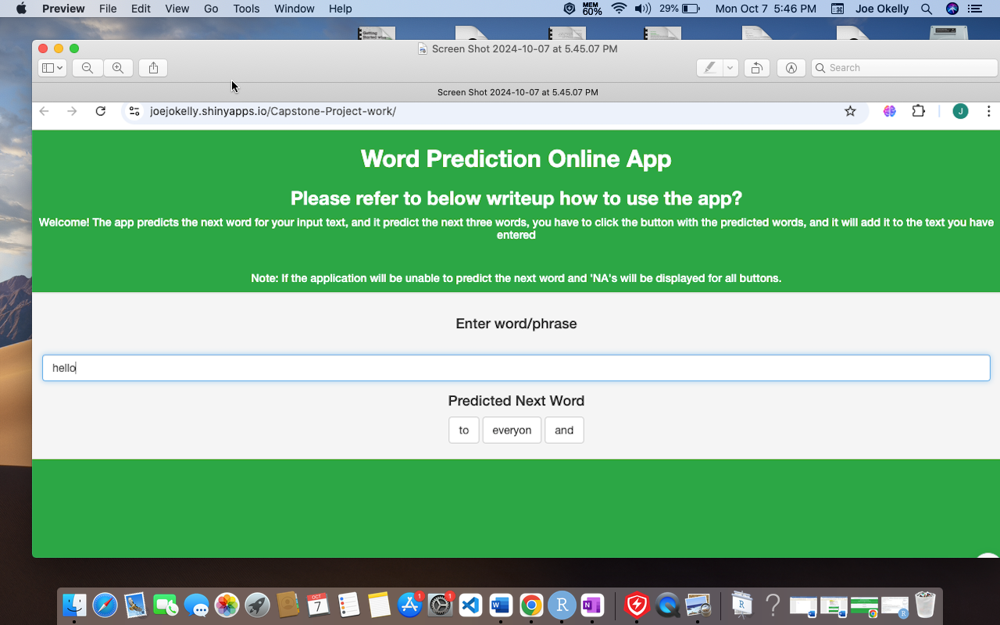

Coursera Data Science Capstone Project - Part-II
========================================================
author: Joe Okelly
date: October 7, 2024

Overview
========================================================

If you wish t o try out the app, clic
k on the link https://joejokelly.shinyapps.io/Capstone-Project-work/

- The app predicts the next word as the user type a word or a group of words.
- The app used the Swiftkey technology

How To Use the App
========================================================

Instructions : 
type a word in the Select box, in the option below it gives you option which you can choose from, on selecting any word it brings the word into the Select box, if no option is avaliable then N/A is displayed.

Getting & Cleaning the Data
========================================================

The original data was sampled from three sources, (blogs, twitter and new) which is later merged into one

- Next, data cleaning is done, stipping white space, conversion to lowercase, removing punctuation and numbers. 
  Later after the process is completed, n-grams are created (Quadgram, Trigram and Bigram).
- Next, the count tables are extracted from N-Grams, and sorted with frequency in descending order.
- The final process is the n-grams are saved into R-compressed files, (.RData files).

Algorithm used 
========================================================

- Checks if highest-order (n =3) trigram is used. If not avaliable "degrades" to a lower-order (eq, n-2) bigram if not avaliable then (n=1) unigram. 

Further Exploration
========================================================

- The code is available on https://github.com/Joejokelly/CapstoneProject-PartII
  Further improvement of this approch is planned, predicting the entire sentences etc.

